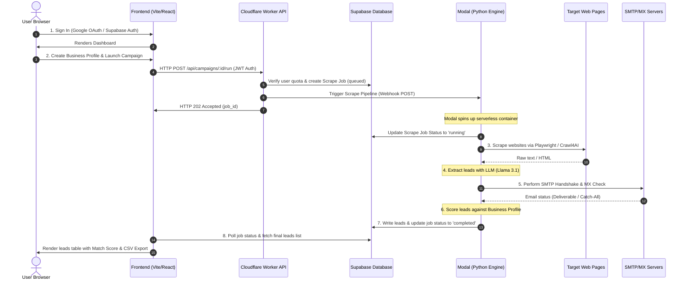

# LeadFlowX (formerly LeadGen AI) — System Architecture & Technical Report

This document details the end-to-end system architecture, technical flow, and technology stack of **LeadFlowX**, a state-of-the-art AI-powered B2B lead generation and prospecting platform.

---

## 1. End-to-End User & Data Journey

When a user visits LeadFlowX and launches a campaign, the request travels through a multi-tiered architecture consisting of a React Single Page Application (SPA), a Cloudflare Worker API router, a Supabase PostgreSQL database, and a serverless Modal engine running distributed Python tasks.

### Flow Breakdown

#### Phase A: Authentication & Workspace Setup
1. **User Landing**: The user lands on the responsive landing page hosted on Cloudflare Pages.
2. **Authentication**: The user logs in via **Google OAuth** or Email. This is handled by **Supabase Auth** on the client side, which yields a cryptographically signed JSON Web Token (JWT).
3. **Context Construction**: The user configures a **Business Profile** (offering, target roles, locations) and optionally uploads contextual PDFs (stored securely in **Supabase Storage**).

#### Phase B: Campaign Launch
1. The user defines a search query (e.g., *"Tech startups in California CTO email"*) and sets a limit, then clicks **Start Finding Leads**.
2. The frontend attaches the Supabase JWT and fires a `POST` request to the Cloudflare Worker API.
3. The Cloudflare Worker validates the JWT, verifies the user's monthly limits, updates the campaign status to `queued`, writes a tracking job to Supabase, and triggers the asynchronous **Modal Pipeline** via a webhook.

#### Phase C: Distributed Web Scraping & AI Engine
1. **Modal Serverless Container**: A Python container spins up instantly on Modal.
2. **Search Discovery**: The container uses search engines and lead aggregators to find relevant company URLs.
3. **Parallel Scraping**: Using **Playwright** and **Crawl4AI**, the engine crawls the target websites, downloading clean markdown representation of their Team, About, and Contact pages.
4. **Information Extraction**: The scraped text is sent to an LLM (Llama 3.1 / Gemini) to extract names, job titles, business roles, and public email handles.

#### Phase D: Email Verification & Scoring
1. **SMTP Handshake & MX Validation**: The engine queries target domain mail servers for MX records and initiates a safe, non-sending SMTP handshake to test if the extracted email address is valid, role-based, catch-all, or disposable.
2. **ICP Matching (Scoring)**: The AI compares the extracted lead's profile (Role, Industry, Company Description) against the user's saved **Business Profile** to calculate a relevance score (0 - 100%).
3. **Database Write**: The verified, scored leads are written back to the Supabase database. The job status is set to `completed`.

#### Phase E: Real-time UI Delivery
1. The React app polls the job status endpoint. Once complete, it displays the structured leads list.
2. The user can view full lead dossiers, filter by score, and export the entire list to a clean CSV.

---

## 2. Technology Stack

| Layer | Technology | Role |
| :--- | :--- | :--- |
| **Frontend UI** | React 18, Vite, TypeScript | Application shell and state orchestration. |
| **Routing** | TanStack Router | Type-safe client-side routing. |
| **Styling** | Tailwind CSS | Utility-first responsive theme. |
| **Serverless API** | Cloudflare Workers | Ultra-low latency global gateway, JWT decoding, and quota middleware. |
| **Database** | PostgreSQL (Supabase) | Multi-tenant lead tables, user profiles, jobs metadata, and RLS security. |
| **Background Runner** | Modal | Asynchronous serverless engine for Python execution. |
| **AI Integration** | LiteLLM, Cloudflare AI | Dynamic LLM routing (Llama 3.1, Claude, CF Workers AI). |

---

## 3. Open Source & Third-Party Tools

We rely on key open-source technologies to power high-fidelity lead discovery:

1. **Crawl4AI**: Open-source web crawling tool optimized for LLM input generation (removes noise, sidebars, and trackers).
2. **Playwright (Python)**: Headless browser framework to load JavaScript-heavy web applications during extraction.
3. **LiteLLM**: Single-interface translation layer to query multiple AI models and handle fallback routing.
4. **Supabase PostgREST**: Automatically exposes clean, RESTful APIs directly over our PostgreSQL tables, facilitating fast query round-trips.
5. **SMTP-Validator**: Engine implementing deep SMTP handshake verification to check inbox existence without sending actual email messages.
