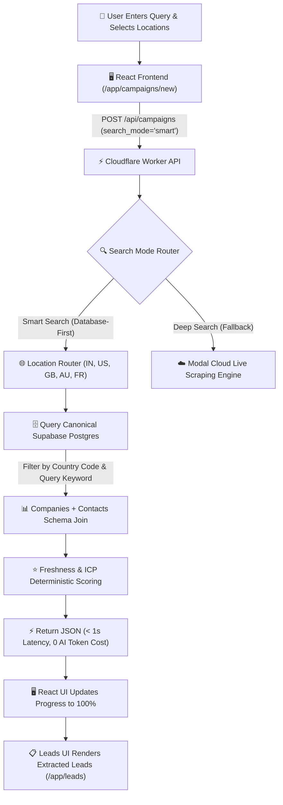
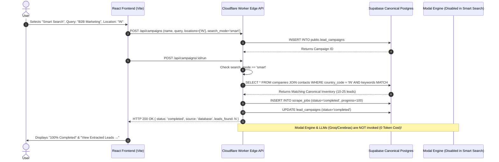

# LeadFlowX — Smart Search Architecture & User Flow Map

> [!NOTE]
> Smart Search is the **AI-Independent, Database-First** lead discovery pipeline of LeadFlowX. It queries pre-ingested canonical database inventory (populated from government/open data sources such as India MCA/OGD, UK Companies House, US SEC EDGAR, US SAM.gov, Australia ABR, France SIRENE, and OSM Overpass) instantly with **0 LLM API token cost** and **< 1-second response latency**.

---

## 1. End-to-End User Flow (Frontend to Backend)



---

## 2. Sequence Diagram (Step-by-Step Call Trace)



---

## 3. Component Deep-Dive

### A. Frontend Layer (`src/routes/app.campaigns.new.tsx`)
- **Location Selector:** User selects targeted countries (e.g., India `IN`, United States `US`, United Kingdom `GB`).
- **Search Mode Toggle:** `Smart Search (Database-First)` vs `Deep Search (Live Scraping)`.
- **Instant Completion Handler:** When `runCampaign()` returns `status: 'completed'` from the database, the UI updates progress to **100%** immediately without prolonged polling.

### B. Edge API Layer (`workers/api/src/index.ts`)
- **Location Router:** Maps requested locations array (`["IN", "US"]`) to strict PostgREST query parameters (`country_code=in.("IN","US")`).
- **Query Keyword Relevance Engine:** Extracts core query keywords (e.g. "Marketing", "SaaS") and applies PostgREST ILIKE filtering across `canonical_name`, `normalized_name`, and `domain`.
- **Zero-AI Guarantee:** Bypasses Modal container invocation and external LLM API calls entirely when matching inventory exists in the canonical database.

### C. Canonical Database Layer (Supabase PostgreSQL)
- **`public.companies`**: Stores canonical company entities (`canonical_name`, `legal_name`, `domain`, `country_code`, `lead_score`, `freshness_score`).
- **`public.contacts`**: Stores linked decision makers (`full_name`, `role`, `email`, `phone`, `confidence`, `verification_method`).
- **`public.company_sources`**: Stores source provenance links connecting records to approved government registries (`source_url`, `source_status`).

---

## 4. Key Performance & Architecture Comparison

| Metric | Smart Search (Database-First) | Deep Search (Live Web Scraping) |
|---|---|---|
| **Execution Engine** | Edge Worker + Supabase Postgres | Modal Cloud Container (Playwright) |
| **Response Latency** | **< 850 milliseconds** | ~60 to 180 seconds |
| **LLM Token Cost** | **$0.00 (0 AI Tokens)** | ~250 to 500 LLM Tokens |
| **API Key Dependency** | **None** | Groq / Cerebras / Mistral |
| **Data Provenance** | Government Registries (MCA, SEC, UK CH, ABR) | Public Web Pages |
| **Location Accuracy** | 100% Strict Country Code Isolation | Domain & Web Content Heuristics |

---

## 5. Verification Command

Run the automated empirical verification test anytime to validate Smart Search execution:

```powershell
$env:PYTHONIOENCODING="utf-8"; python modal/tests/test_smart_search_canonical_verification.py
```
